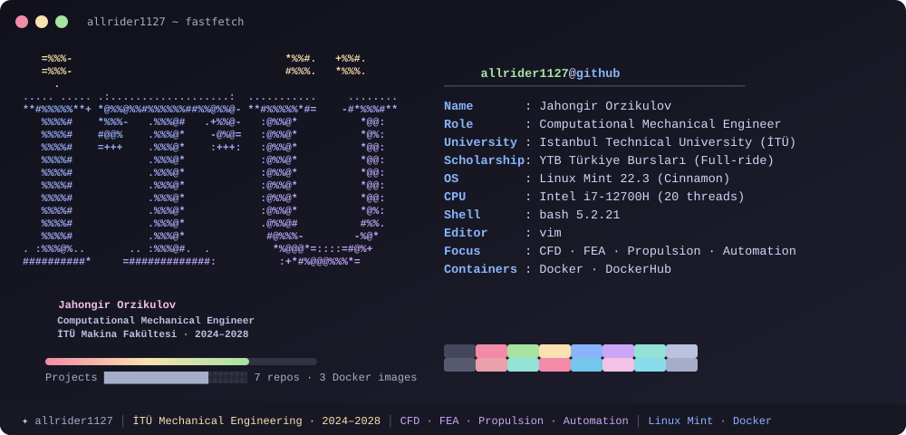
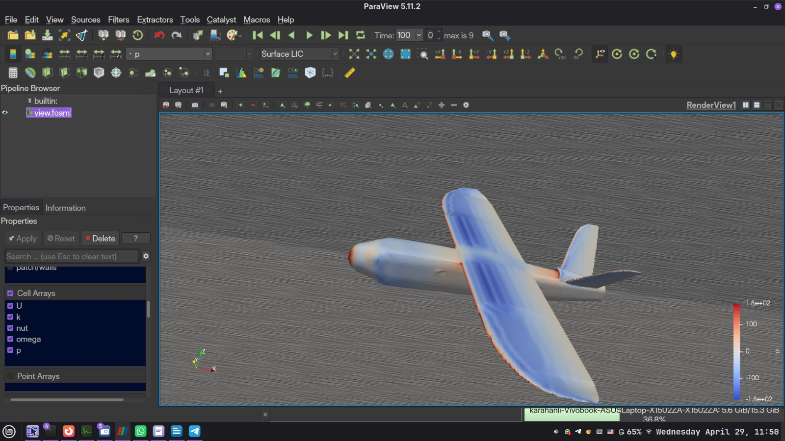
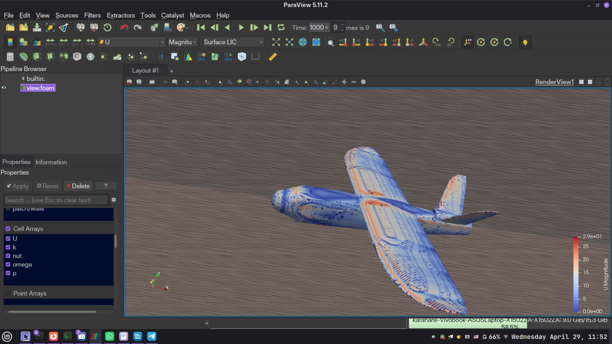
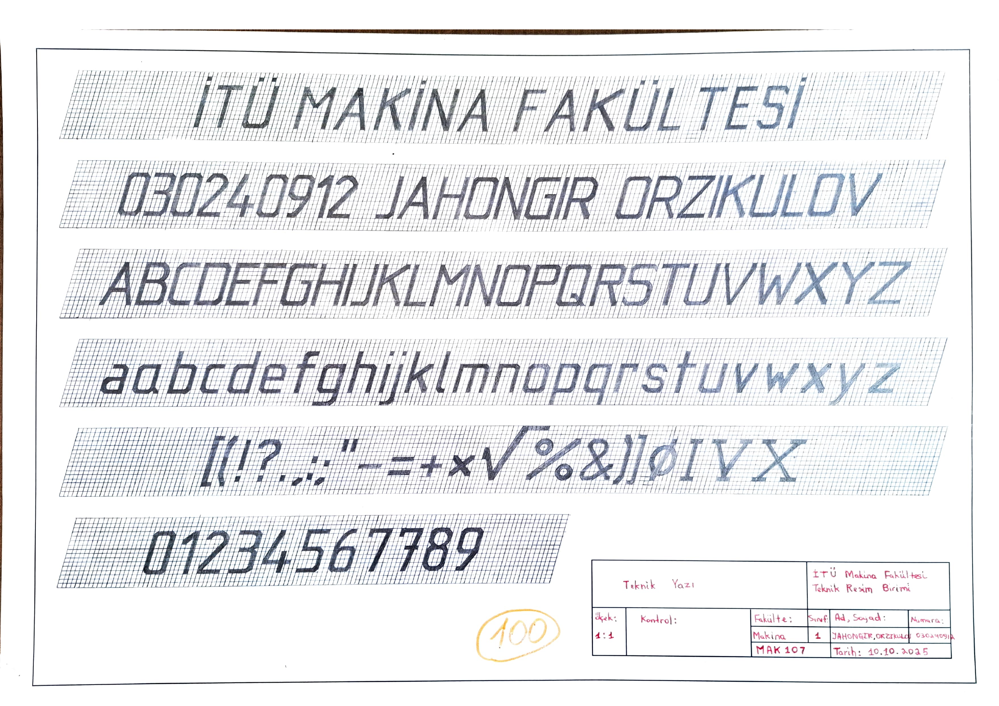
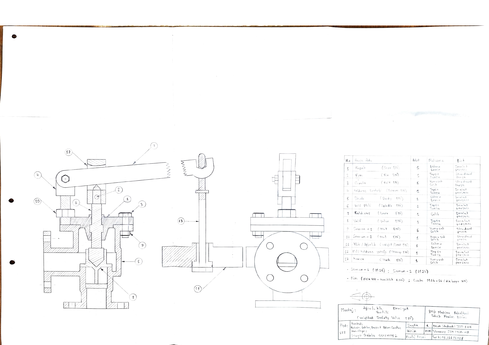

<p align="center">
  
</p>

<h3 align="center">
  <em>"I write simulations that converge — and tools that make sure they do."</em>
</h3>

<p align="center">
  
  
  
  
  
  
  
</p>

---

```cpp
/*--------------------------------*- C++ -*----------------------------------*\
| =========                 |                                                 |
| \\      /  F ield         | OpenFOAM: The Open Source CFD Toolbox           |
|  \\    /   O peration     | Version:  v2512                                 |
|   \\  /    A nd           | Website:  www.openfoam.com                      |
|    \\/     M anipulation  |                                                 |
\*---------------------------------------------------------------------------*/
FoamFile
{
    version     2.0;
    format      ascii;
    class       dictionary;
    object      allrider1127;
}
// * * * * * * * * * * * * * * * * * * * * * * * * * * * * * * * * * * * * * //

name            "Jahongir Orzikulov";
affiliation     "Istanbul Technical University - Mechanical Engineering";
roles           ("Computational Mechanical Engineer" "CFD Analyst" "Systems Engineer");
focus           "Compressible Flow · Solver Automation · HPC Pipelines · Propulsion";

stack
{
    simulation  (OpenFOAM CalculiX SU2 Code_Saturne "Elmer FEM" "NASA CEA");
    languages   (Python C++ Bash C# C MATLAB);
    cad         (Onshape SolidWorks "Fusion 360" AutoCAD FreeCAD Blender Meshmixer FlashPrint LibreCAD);
    infra       (Docker Linux MPI Vim Conda Git);
    ai          (Ollama "Hermes Agent" "Agentic AI" "SLM (Llama 3.2, Qwen)");
}

creed           "Simulate it. Validate it. Automate it. Ship it.";

// ************************************************************************* //
```

---

## 🔬 Featured Projects

### 🛩️ [Foam-Agent](https://github.com/csml-rpi/Foam-Agent) — Open Source Contribution

<p>
  
  
  
  
</p>

```cpp
/*---------------------------------------------------------------------------*\
| PR Details:                                                                 |
\*---------------------------------------------------------------------------*/
mergeInfo
{
    repository  "csml-rpi/Foam-Agent";
    status      "Merged";
    linesAdded  1421;
    venue       "NeurIPS 2025 · ML for Physical Sciences";
    paper       "arXiv:2505.04997";
}
// ************************************************************************* //
```

[Foam-Agent](https://github.com/csml-rpi/Foam-Agent) — a NeurIPS-published multi-agent framework for automating CFD simulations in OpenFOAM ([arXiv:2505.04997](https://arxiv.org/abs/2505.04997)).

- **Engineered a 5-stage ESI translation middleware** that enables Foundation v10 case files to run on ESI OpenFOAM containers (v2312, v2512) — eliminating the need for re-indexing the entire tutorial database
- **Wired the translator into both the LangGraph pipeline and the MCP server**, with post-translation state refresh to prevent stale graph nodes
- **10/10 pytest pass** with regression coverage for Allrun bypass, regex scoping, and structural file remapping

> *"This is a very important contribution to the community and a very good design."*
> — [LeoYML](https://github.com/LeoYML), Foam-Agent maintainer ([comment on PR #35](https://github.com/csml-rpi/Foam-Agent/pull/35#issuecomment-4529480832))

---

### 🦅 [Talon UCAV — TEKNOFEST 2026 CFD](https://github.com/allrider1127/ytb_teknofest_ucav)

<p>
  
  
  
  
  
</p>

Full aerodynamic analysis of the **Talon UCAV** for SkyGuard Alliance — **1.7M cell hex-dominant mesh**, converged at 1000 iterations. The entire simulation was **orchestrated overnight** using my [KOR-Orchestrator](https://github.com/allrider1127/kor-orchestrator) daemon while I slept.

**Why k-ω SST?** — Industry standard for external aerodynamics. Accurately resolves near-wall boundary layers and adverse pressure gradients without wall functions, critical for predicting flow separation on swept delta wings.

**Why `simpleFoam`?** — Steady-state incompressible RANS solver. At 20 m/s freestream (Ma ≈ 0.06), compressibility effects are negligible — incompressible assumption holds.

| Parameter | Value | Significance |
|:---|:---|:---|
| **Lift-to-Drag Ratio** (L/D) | **9.99** | Excellent for blended wing-body UCAV |
| **Lift Coefficient** (C_L) | **0.3236** | Stable cruise lift at α = 5° AoA |
| **Drag Coefficient** (C_D) | **0.0324** | Low parasitic drag — clean airframe |
| **Pressure Residual** | 1.8 × 10⁻⁶ | Machine-precision convergence |
| **Continuity Error** | 2.4 × 10⁻⁹ | Mass conservation verified |

<p align="center">
  
  
</p>
<p align="center"><em>Left: Surface Pressure Distribution (p) — Right: Velocity Field & Surface LIC (U) @ 20 m/s</em></p>

---

### ⚡ [KOR-Orchestrator](https://github.com/allrider1127/kor-orchestrator) — Local HPC Daemon

<p>
  
  
  
  
</p>

A **zero-dependency Python daemon** that treats your personal workstation like a production compute node. Built entirely on Python's standard library — no pip packages, no YAML configs, no SLURM.

```
┌─────────────────────────────────────────────────────┐
│   50°C        75°C        80°C        90°C          │
│   ┃───────────┃───────────┃───────────┃             │
│   ▲           ▲           ▲           ▲             │
│   normal      warning     resume      STOP          │
│                                                     │
│   Below 80°C  →  SIGCONT / docker unpause           │
│   Above 90°C  →  SIGSTOP / docker pause             │
└─────────────────────────────────────────────────────┘
```

- **Thermal protection** — auto-pauses workloads at 90°C via `docker pause` / `SIGSTOP`, resumes at 80°C
- **Two-stage log scraper** — detects `FOAM FATAL ERROR` in real-time across 10,000+ lines/sec of solver output
- **Overnight mode** — `--mode shutdown` with 30s Polkit-gated poweroff after last job completes
- **Used this daemon to run the Talon UCAV simulation** — queued the 1.7M-cell CFD job before bed, woke up to converged results

---

### 🕵️ [SAHA 2026 Intelligence Pipeline](https://github.com/allrider1127/saha2026-intelligence)

<p>
  
  
  
  
</p>

An **autonomous OSINT pipeline** that scrapes the SAHA 2026 defense expo exhibitor registry, cross-references company data, and uses a locally hosted SLM (Llama 3.2 3B) with native JSON enforcement to **binary-classify 1,532 firms** — filtering out finance/SaaS noise and scoring hardware engineering targets for internship relevance.

- **Dual-process architecture** — Playwright stealth scraper + LLM classification agent running in parallel
- **Crash-safe & resumable** — heartbeat checkpoints + SQLite WAL database, graceful kill switch
- **CPU-only optimized** — ~2GB RAM at inference on i7-12700H, `keep_alive=0` for immediate model unload
- **Result:** 149 verified hardware engineering firms out of 1,532 exhibitors (9.7% signal-to-noise)

```bash
docker run --rm -it \
  --add-host=host.docker.internal:host-gateway \
  -v "$(pwd):/app" \
  allrider1127/saha2026-intelligence
```

---

### 📐 [MAK 107 — Hand-Drawn Engineering Portfolio](https://github.com/allrider1127/mak107)

**24 hand-drawn engineering sheets** produced for MAK 107 (Technical Drawing) at İTÜ — pencil on A3/A2 paper using T-squares, set squares, compasses, and mechanical pencils under strict ISO 128/129 standards.

> **⚡ Speed of Execution:**
> - **Assignment 2** (Safety Valve Assembly — 10 detail drawings + 1 A2 assembly) — submitted **6 days after the assignment was announced**. The rest of the class had the **entire 13-week semester** to complete it. First and fastest submission in the faculty.

<p align="center">
  
  
</p>
<p align="center"><em>Left: Assignment 1 — Technical Lettering on A3 (ISO) — Right: Assignment 2 — Safety Valve Assembly on A2 (ISO)</em></p>

---

### 🖨️ [MAK 199 — CAD & Additive Manufacturing](https://github.com/allrider1127/mak199)

**11 engineering sprints** covering the full digital manufacturing pipeline: caliper metrology → parametric CAD → optical scanning → mesh repair → slicing optimization → rapid prototyping.

- **Toolchain:** OnShape, SolidWorks, Blender, Meshmixer, FlashPrint, AutoCAD, FreeCAD
- **Hardware:** EinScan SE-SP V2 3D Optical Scanner, FlashForge 3D Printer
- **Physical-to-Digital:** Every scanned part is backed by a version-controlled digital twin

---

## 🛠️ Tech Arsenal

<table>
<tr><td><strong>Simulation</strong></td><td>


</td></tr>
<tr><td><strong>Languages</strong></td><td>


</td></tr>
<tr><td><strong>CAD/CAM</strong></td><td>


</td></tr>
<tr><td><strong>Infrastructure</strong></td><td>


</td></tr>
<tr><td><strong>AI / Automation</strong></td><td>


-f9e2af?style=flat-square)

</td></tr>
<tr><td><strong>Documentation</strong></td><td>


</td></tr>
</table>

---

## 🏆 Open Source Contributions

**Foam-Agent** — [csml-rpi/Foam-Agent](https://github.com/csml-rpi/Foam-Agent) • [PR #35](https://github.com/csml-rpi/Foam-Agent/pull/35) • Merged

An end-to-end composable multi-agent framework for automating CFD simulations in OpenFOAM, published at **NeurIPS 2025 Machine Learning and the Physical Sciences Workshop**.

I implemented a **runtime ESI translation middleware** that post-processes Foundation v10 case files to run correctly on ESI OpenFOAM containers — a 5-stage deterministic mutation pipeline with JSON-based rule configuration, Allrun bypass filtering, and full pytest regression coverage.

```cpp
/*---------------------------------------------------------------------------*\
| Publication Details:                                                        |
\*---------------------------------------------------------------------------*/
FoamAgentPaper
{
    title       "Foam-Agent: Towards Automated Intelligent CFD Workflows";
    authors     (Yue Somasekharan Zhang Cao Chen Di Pan);
    venue       "NeurIPS 2025 ML for Physical Sciences Workshop";
    paper       "arXiv:2505.04997";
    code        "github.com/csml-rpi/Foam-Agent";
    myPR        "#35 -> Merged (+1,421 lines, 14 files)";
}
// ************************************************************************* //
```

[📎 Read the paper](https://arxiv.org/abs/2505.04997) · [🔀 View the PR](https://github.com/csml-rpi/Foam-Agent/pull/35)

---

## 🎓 Background

- 🏛️ **Istanbul Technical University** — B.Sc. Mechanical Engineering (2024–2028)
- 🎓 **YTB Türkiye Bursları** — Full-ride scholarship + **Üstün Başarı Burs Programı** (double stipend)
- 🏫 **Jizzakh Presidential School** — Cambridge A-Levels (Physics, Chemistry, Mathematics), CIS Accredited
- 📊 **SAT 1540** (Math 800/800) • **IELTS 7.5**
- 🇺🇿 Uzbek (native) · 🇬🇧 English (C1) · 🇹🇷 Turkish (C1) · 🇷🇺 Russian (elementary)
- 🛡️ **SAHA 2026 Expo** — UAE Pavilion Coordinator (ADNEC Group, EDGE, Calidus, TAWAZUN)
- ✈️ **TEKNOFEST 2026** — SkyGuard Alliance (UCAV aerodynamics + Liquid rocket propulsion teams)

---

## 📬 Contact

| | |
|:---|:---|
| **Institutional** | [orzikulov24@itu.edu.tr](mailto:orzikulov24@itu.edu.tr) |
| **Telegram** | [@astra_empire](https://t.me/astra_empire) |
| **GitHub** | [@allrider1127](https://github.com/allrider1127) |
| **LinkedIn** | [Jahongir Orzikulov](https://linkedin.com/in/jahongir-orzikulov-1b2247236) |

---

<p align="center">
  <sub><code>// built on linux mint · compiled with vim · shipped via git</code></sub>
</p>
